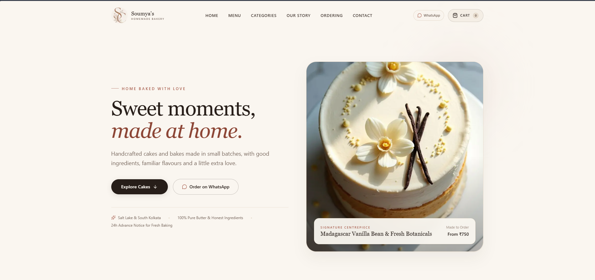
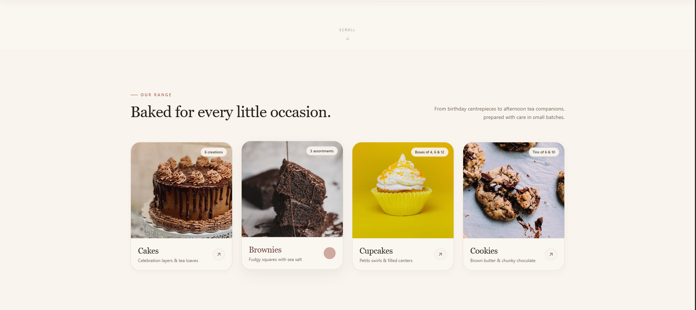
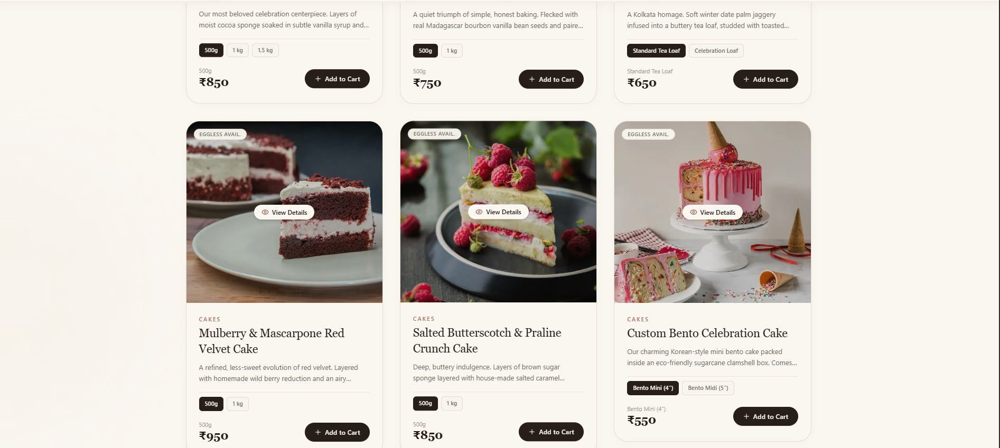
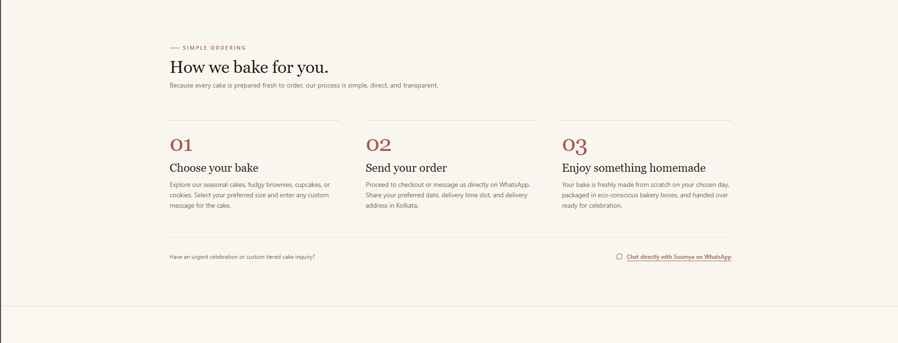
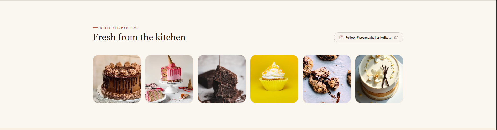
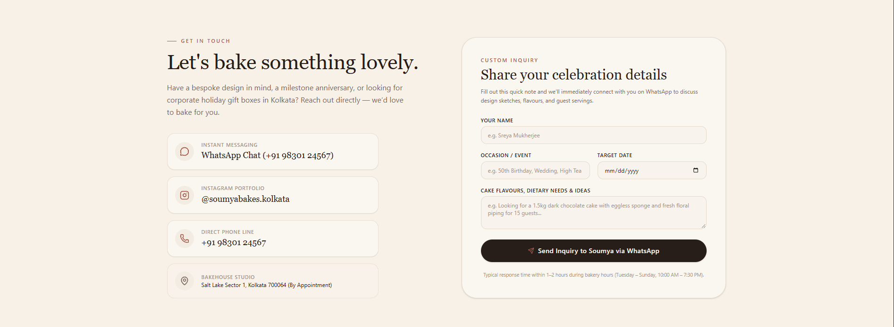

🍰 Soumya's Creations

  <strong>A warm, editorial home-bakery experience made for thoughtful celebrations.</strong>

  <a href="https://soumyas-creation-kolkata.vercel.app/" target="_blank">
    <strong>✨ View the Live Website →</strong>
  </a>

  Handcrafted cakes • Small-batch bakes • Kolkata

✨ Preview

Hero

Cakes & Ordering

How We Bake

Ordering Information

🌿 Design Direction

The visual language is intentionally soft and editorial rather than overly polished or “SaaS-like”.

Warm ivory, oat, espresso, blush, and terracotta tones

Serif-led typography with restrained sans-serif supporting text

Generous whitespace and rounded image framing

Premium food-editorial aesthetic

Subtle motion instead of distracting animation

Mobile-first product browsing and ordering flow

The website should feel like an invitation to share something sweet, not just another online store.

🛍️ Core Experience

Browse

Explore cakes, brownies, cupcakes, and cookies through a visually curated product menu.

Discover

Filter products by category, search flavours and ingredients, and find eggless options.

Product Details

Open a product to view its details, available sizes, ingredients, and ordering options.

Cart

Add products to the cart, adjust quantities, and review the order before checkout.

Order

Move from the website into a simple ordering flow designed around a home-bakery workflow and WhatsApp communication.

🎞️ Motion Philosophy

The site uses motion as part of the brand experience rather than decoration.

The direction is:

slow where the user looks, fast where the user acts.

Subtle scroll movement, image reveals, product-card interactions, cart transitions, and restrained micro-interactions are used to make the experience feel tactile and premium.

🧱 Tech Stack

Next.js

React

TypeScript

Tailwind CSS

Motion

Lenis

Lucide Icons

📁 Project Structure

app/
components/
config/
context/
data/
hooks/
lib/
public/
services/
types/
utils/

🚀 Run Locally

npm install
npm run dev

Open:

http://localhost:3000

📸 Screenshot Assets

The images above are stored in:

public/screenshots/

hero1.png
hero2.png
hero3.png
thecakesorder.png
howwebake.png
ordersection.png

❤️ Built For

Soumya's Creations

A small-batch home bakery in Kolkata focused on handcrafted desserts, thoughtful preparation, and personal celebrations.

🌐 Live

  <a href="https://soumyas-creation-kolkata.vercel.app/">
    <strong>soumyas-creation-kolkata.vercel.app ↗</strong>
  </a>

📌 Status

Active development — refining the visual system, motion design, product experience, and ordering flow before deployment.
